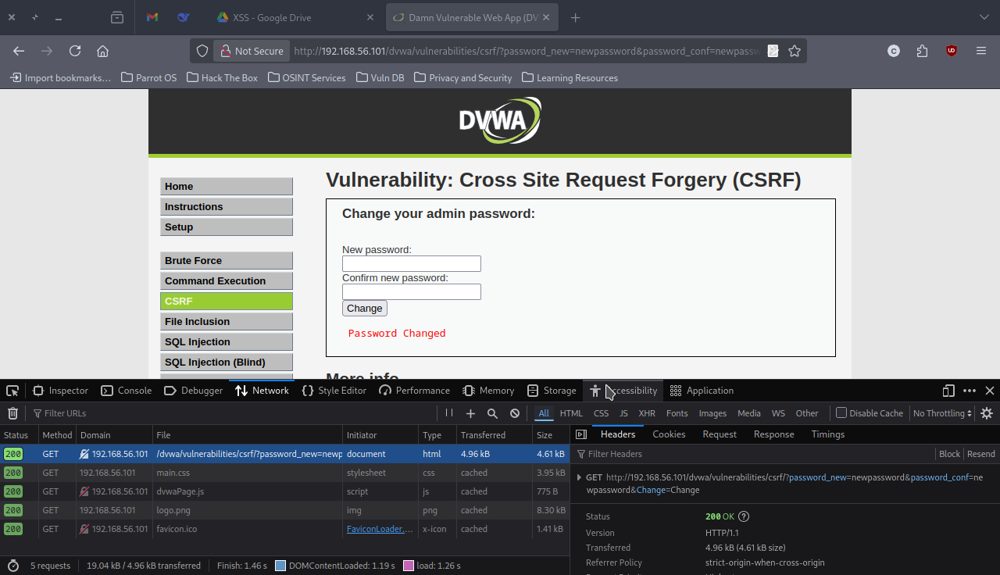
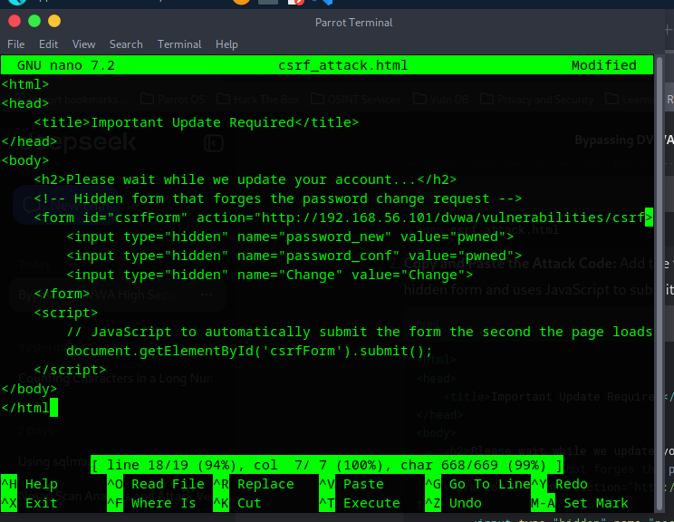
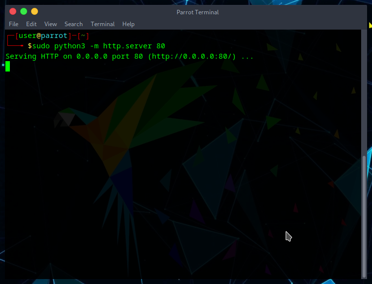
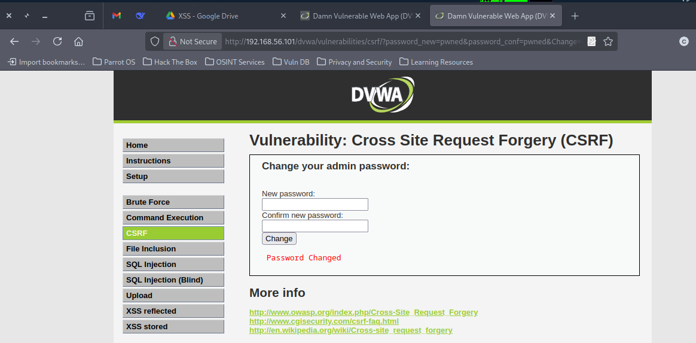
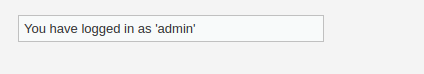

# Cross-Site Request Forgery (CSRF) Exploitation on DVWA

## Overview

| **Focus** | Cross-Site Request Forgery Attack Implementation |
|-----------|--------------------------------------------------|
| **Target** | DVWA v1.10 Password Change Functionality |
| **Objective** | Demonstrate CSRF vulnerability exploitation leading to account takeover |
| **Status** | ✅ Successfully Compromised Admin Account |

## Executive Summary

Successfully exploited a Critical-rated Cross-Site Request Forgery vulnerability in DVWA's password change functionality. The attack leveraged the application's trust in authenticated browser sessions to silently change an administrator's password through a malicious external website. This vulnerability allows complete account takeover without the victim's knowledge, demonstrating the severe impact of missing CSRF protections in state-changing operations.

## Environment Configuration

| Component | Details |
|-----------|---------|
| **Target Application** | Damn Vulnerable Web Application (DVWA) v1.10 |
| **Target IP** | `192.168.56.101` |
| **Attacker Machine** | Parrot Security OS |
| **Attacker IP** | `192.168.56.102` |
| **Security Level** | Low |
| **Target URL** | `http://192.168.56.101/dvwa/vulnerabilities/csrf/` |

## Vulnerability Assessment

### Technical Analysis

**Vulnerability Type:** Cross-Site Request Forgery (CSRF)
**CVSS v3.1 Score:** 8.8 (High)
**Attack Vector:** Network
**Attack Complexity:** Low
**Authentication Required:** None (for the malicious site)

### Root Cause Analysis

The password change functionality suffers from multiple security weaknesses:

1. **GET Method Usage:** Password changes processed via HTTP GET requests
2. **Missing CSRF Tokens:** No anti-CSRF tokens to validate request authenticity  
3. **Insufficient Origin Validation:** Application accepts requests from any source
4. **Session Trust Abuse:** Over-reliance on browser session cookies for authorization

## Evidence

### Phase 1: Request Analysis


The Developer Tools Network tab revealed the vulnerable request structure:
```
GET /dvwa/vulnerabilities/csrf/?password_new=newpassword&password_conf=newpassword&Change=Change
```

### Phase 2: Malicious Payload Creation


Created a weaponized HTML file containing:
- Hidden form with pre-filled malicious password (`pwned`)
- Auto-submit JavaScript for stealth execution
- Social engineering cover story for victim interaction

### Phase 3: Attack Infrastructure


Deployed attack infrastructure using Python's built-in web server:
```bash
sudo python3 -m http.server 80
```

### Phase 4: Successful Exploitation


The attack executed successfully, with DVWA displaying "Password Changed" confirmation after visiting the malicious site.

### Phase 5: Account Takeover Verification


Post-exploitation verification confirmed complete account compromise:
- Original credentials (`admin:password`) no longer functional
- Attacker credentials (`admin:pwned`) granted full administrative access

## Skills Developed

- **CSRF Attack Vector Analysis:** Understanding how browsers handle cross-origin requests
- **Social Engineering Integration:** Combining technical exploits with user manipulation  
- **Request Forgery Techniques:** Crafting malicious forms that mimic legitimate functionality
- **Web Server Deployment:** Setting up attack infrastructure for payload delivery
- **Session Management Exploitation:** Leveraging authenticated browser sessions
- **Post-Exploitation Verification:** Confirming attack success and impact scope

## Exploitation Results

**Pre-Attack State:**
- Admin account secured with original password
- No indication of security vulnerabilities to end user

**Post-Attack State:**  
- Complete administrative account takeover achieved
- Password changed to attacker-controlled value (`pwned`)
- Original authentication credentials invalidated
- Full access to application administrative functions

**Attack Success Metrics:**
- ✅ Successful request forgery execution
- ✅ Silent password modification without victim awareness  
- ✅ Complete account compromise verification
- ✅ Persistent access establishment

## Defensive Recommendations

### Immediate Remediation
1. **Implement Anti-CSRF Tokens:** Generate unique, unpredictable tokens for each user session
2. **Enforce POST Methods:** Require POST requests for all state-changing operations
3. **Origin Header Validation:** Verify requests originate from the application domain
4. **Same-Site Cookie Configuration:** Set cookies with `SameSite=Strict` attribute

### Long-Term Security Enhancements
1. **Content Security Policy:** Implement strict CSP headers to prevent malicious script injection
2. **Double-Submit Cookie Pattern:** Use additional CSRF protection mechanisms
3. **User Confirmation:** Require current password for critical account changes
4. **Session Management:** Implement proper session invalidation on sensitive changes
5. **Security Headers:** Deploy comprehensive security headers (X-Frame-Options, etc.)

### Monitoring & Detection
1. **Anomaly Detection:** Monitor for unusual patterns in password change requests
2. **Referer Header Analysis:** Log and analyze HTTP referer patterns
3. **Rate Limiting:** Implement controls on sensitive operations frequency
4. **User Notification:** Alert users of account modifications via email/SMS

## Educational Disclaimer

This penetration test was conducted in a controlled laboratory environment using DVWA, which is specifically designed for security testing and education. All activities were performed on isolated virtual machines without impact on production systems. This documentation serves educational purposes to demonstrate real-world attack vectors and their prevention methods.
